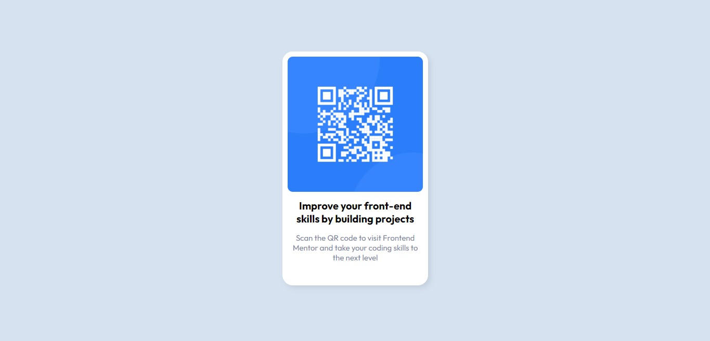

# Frontend Mentor - QR code component solution

This is a solution to the [QR code component challenge on Frontend Mentor](https://www.frontendmentor.io/challenges/qr-code-component-iux_sIO_H). Frontend Mentor challenges help you improve your coding skills by building realistic projects. 

### Screenshot

### Built with

- Semantic HTML5 markup
- CSS custom properties

### What I learned

In this challenge, I reinforced the concept of image manipulation

## Author

- Website - [QR Code](https://joatancarlos.github.io/qr-code-challenge/)
- LinkedIn - [Joatan Feitosa](www.linkedin.com/in/joatan-feitosa
)
- Frontend Mentor - [@Joatancarlos](https://www.frontendmentor.io/profile/Joatancarlos)

